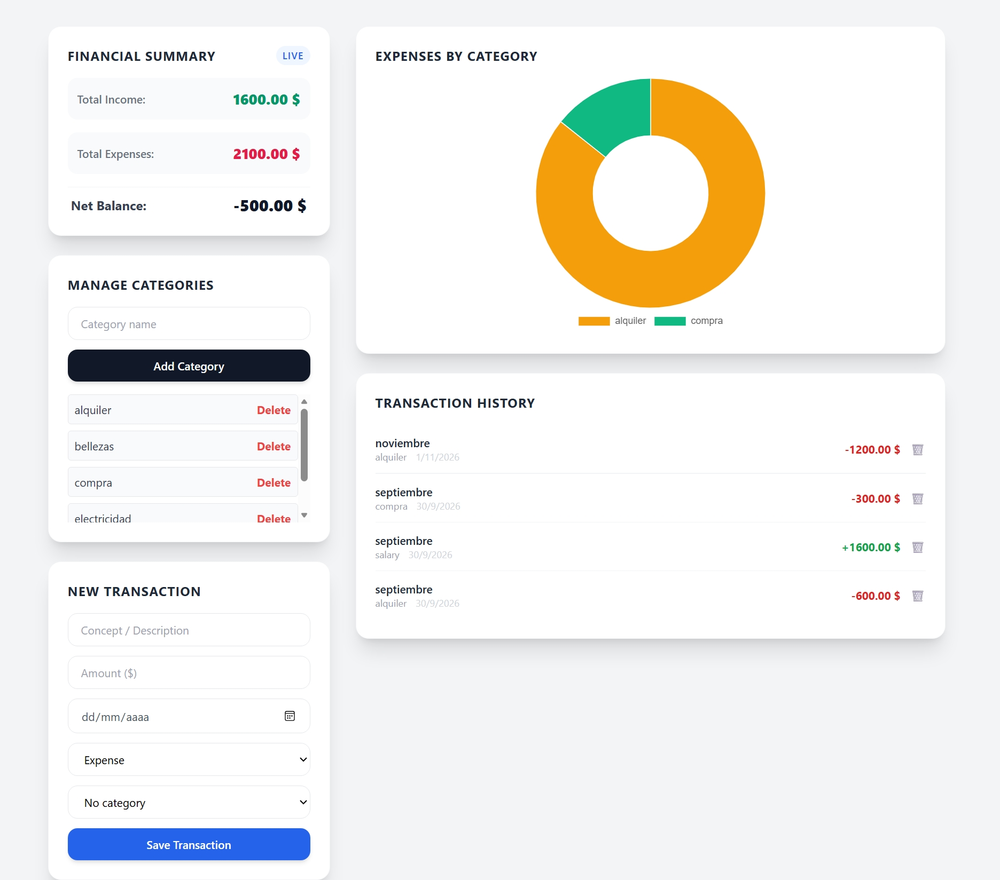

# 💰 Personal Finance Manager

A minimalist web app for tracking personal finances in real time. Users can log income and expenses, organize them into custom categories, and see where their money goes with an interactive chart.

🔗 **Live Demo:** [finanzas-app-silk-sigma.vercel.app](https://finanzas-app-silk-sigma.vercel.app/)



## 🛠️ Tech Stack

- **Frontend:** HTML5, Tailwind CSS, vanilla JavaScript (ES6+)
- **Backend & Database:** [Supabase](https://supabase.com) (PostgreSQL + Auth)
- **Data Visualization:** [Chart.js](https://www.chartjs.org)
- **Deployment:** [Vercel](https://vercel.com), with continuous deployment from GitHub

## ✨ Features

- **Authentication:** sign up with email confirmation (a verification link is emailed before the account can be used), sign in and sign out with Supabase Auth.
- **Transactions:** record income and expenses with a concept, amount, date and optional category.
- **Custom categories:** create and delete your own categories to classify transactions.
- **Live financial summary:** total income, total expenses and net balance, updated after every change.
- **Expenses by category chart:** a doughnut chart fed by a PostgreSQL view (`resumen_por_categoria`) that groups spending per category.
- **Monthly budgets:** set a spending limit per category and track it with a progress bar (green, amber when close, red when over budget).
- **Month filter:** view transactions, totals, chart and budgets for a specific month.
- **Edit transactions:** update any transaction from the history list.
- **CSV export:** download the transactions shown (all or a single month) as a CSV file ready for Excel.
- **XSS protection:** user-entered text is escaped before being rendered as HTML.

## 🗄️ Database

| Table / View | Purpose |
|---|---|
| `transacciones` | Each income or expense: concept, amount, type, date, category and owner |
| `categorias` | User-defined categories |
| `presupuestos` | Monthly spending limit per category (one per category and user) |
| `resumen_por_categoria` | View that sums expenses per category for the chart |

## ⚙️ Running Locally

1. Clone the repository:
   ```bash
   git clone https://github.com/joseartillero-ship-it/finanzas-app.git
   ```
2. Open the folder in VS Code.
3. Set your own Supabase project URL and publishable key at the top of `app.js`.
4. Start a local server (for example, the **Live Server** extension) and open `index.html`.

## 📁 Project Structure

```
finanzas-app/
├── index.html   # Page layout and forms
├── app.js       # Supabase client, data loading, forms and chart
└── README.md
```
